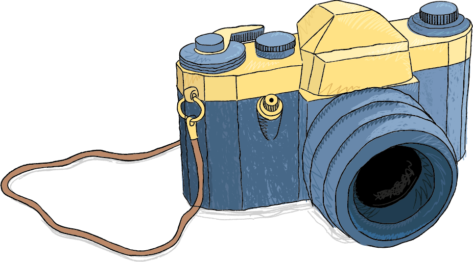

<h1 align="center">
  <br>
  <a href="#"></a>
  <br><br>
</h1>

<h4 align="center">Library and tools to create and parse initial ramdisk snapshots. </h4>

<p align="center">
  <a href="https://travis-ci.org/HQarroum/initrd-snapshot">
    
  </a>
</p>
<br>

## Description

Initial ramdisks (initrd) provide the capability to load a RAM disk by the boot loader. This RAM disk can then be mounted as the root file system and programs can be run from it. Afterwards, a new root file system can be mounted from a different device. The previous root (from initrd) is then moved to a directory and can be subsequently unmounted.

`initrd` snapshots are mainly designed to allow system startup to occur in two phases, where the kernel comes up with a minimum set of compiled-in drivers, and where additional modules are loaded from `initrd`.

This project contains different components, namely :

 * A C++11 library initially developped to provide the [Microcosm Kernel](https://github.com/HQarroum/microcosm) with the ability to load its root filesystem, though it is not dependant on any of microcosm's software components.
 * A set of POSIX tools built on top the library to create and browse initrd images.

## Library usage

### Creating an image in memory

In order to create an `initrd` image you can use the image builder that is bundled with the library before writing it to a file :

```c++
auto image = initrd::builder_t()
  .addFile({ file: file_1, size: size_of_file_1 })
  .addFile({ file: file_2, size: size_of_file_2 })
  .addFiles(list_of_files)
  .build()
```

### Writing the image to disk

Once the image has been constructed in memory, you can write the image raw data to disk by calling the `.data()` accessor on the `initrd::image_t` class :

```c++
std::ofstream file("initrd.img", std::ofstream::out);

file.write(image.data(), image.size());
file.close();
```

### Reading an image from disk

The operation here involves loading an image from the disk, and passing it to `initrd::reader_t` :

```c++
std::ifstream      file("initrd.img, std::ios::binary | std::ios::ate);
std::ostringstream ostream;

std::copy(std::istreambuf_iterator<char>(fin),
     std::istreambuf_iterator<char>(),
     std::ostreambuf_iterator<char>(ostream));
ostream.seekp(0, ios::end);
std::streampos size = oss.tellp();

try {
  initrd::reader_t reader(ostream.str().data(), size);
  std::cout << reader.image() << std::endl;
} catch (std::exception& e) {
  std::cout << e.what() << std::endl;
}
```
